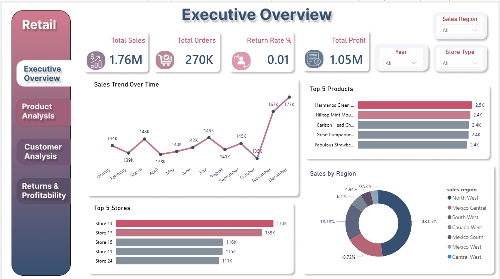
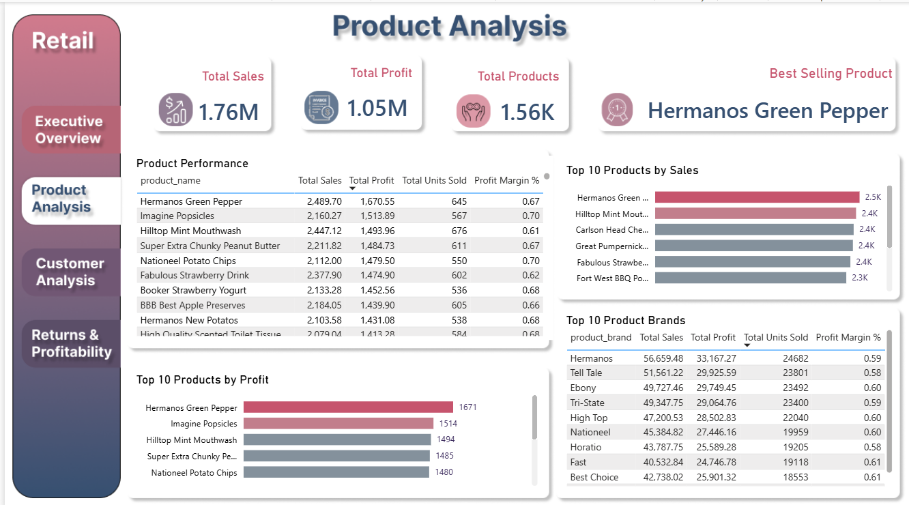
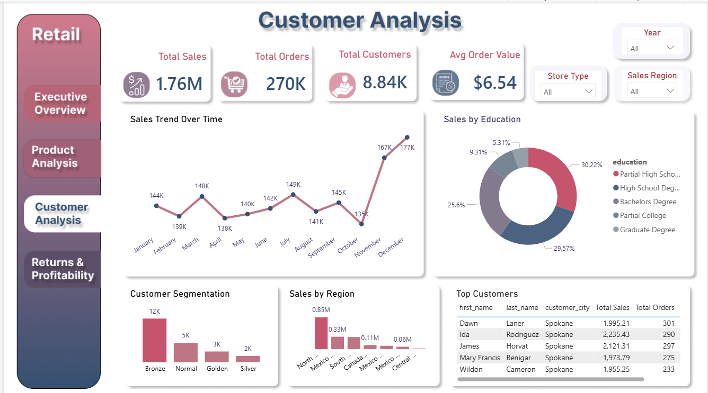
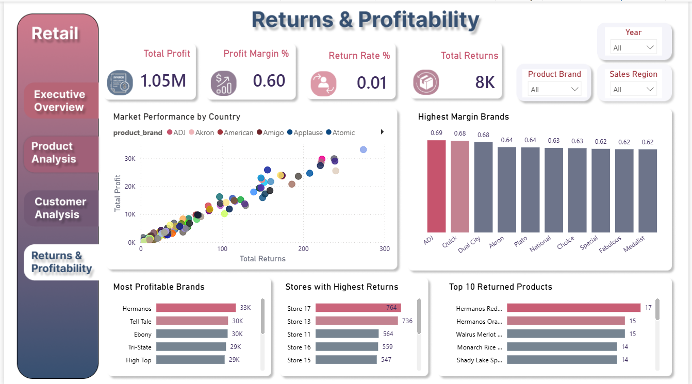

# Retail Data Warehouse Dashboard

## Project Overview

This project demonstrates the design and development of a Retail Data Warehouse Dashboard using Power BI.

The dashboard provides insights into:

- Sales Performance
- Product Performance
- Customer Analysis
- Returns & Profitability

---

## Tools Used

- SQL
- Power BI
- DAX
- Figma

---

# Retail Data Warehouse Dashboard

## Executive Overview

## Product Analysis

## Customer Analysis

## Returns & Profitability

---

## Key KPIs

- Total Sales
- Total Orders
- Total Profit
- Return Rate
- Average Order Value
- Customer Segmentation
- Product Profitability

---

## Author

**Gehad Khairy Mosaed**

Computer Science & AI Student | Aspiring Data Analyst
