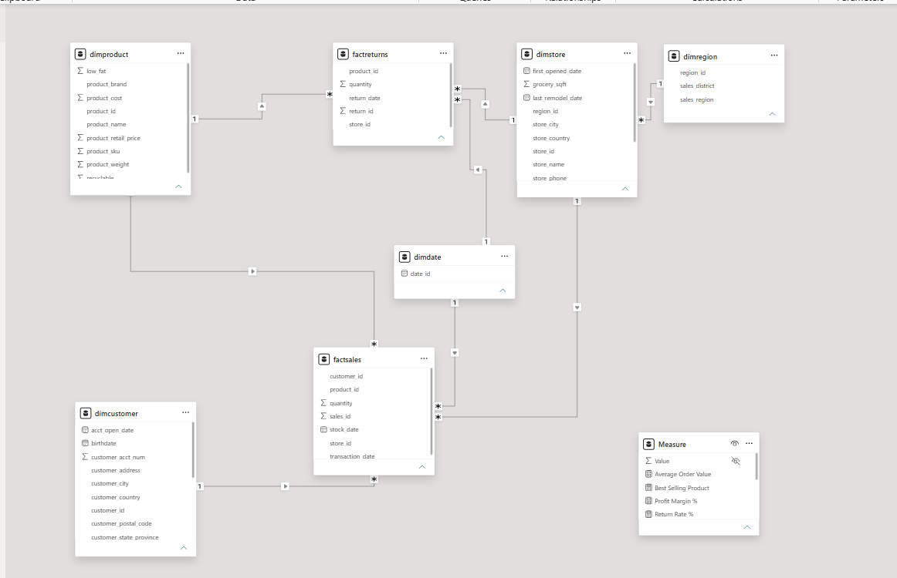
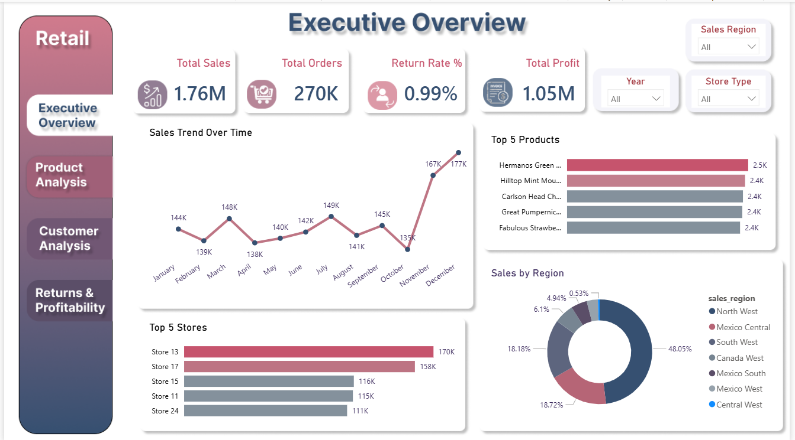
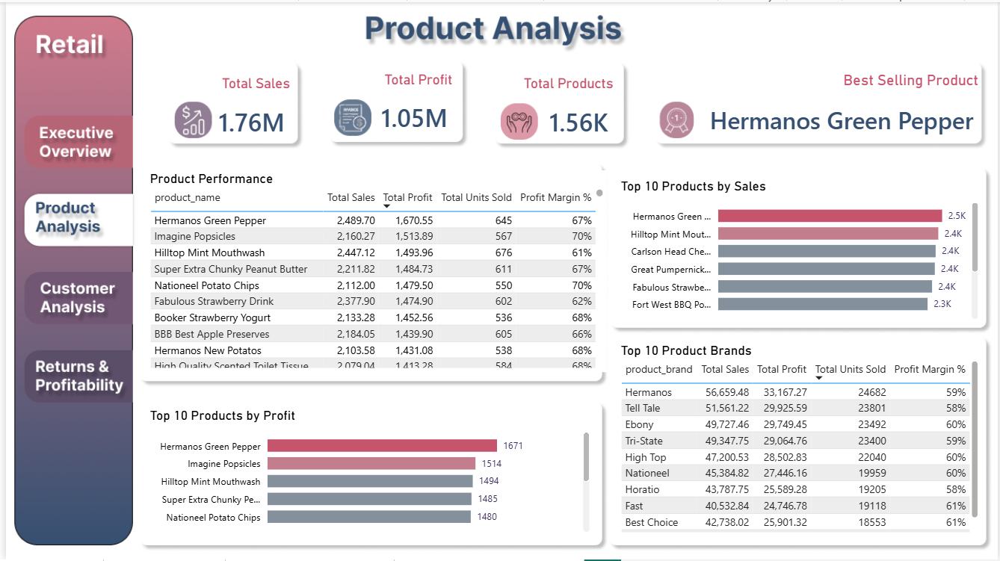
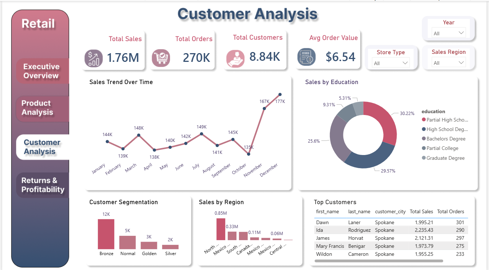
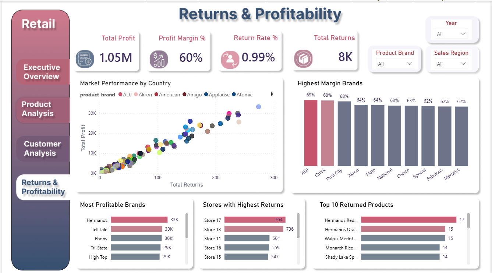

# 🛒 Retail Data Warehouse & Power BI Analytics Project

## 📌 Project Overview

This project demonstrates an end-to-end Retail Data Analytics solution using:

- SQL Data Warehouse
- ETL Process
- Star Schema Data Modeling
- Power BI Dashboard Development
- DAX Measures & KPIs

The goal is to transform raw retail data into actionable business insights through a scalable data warehouse and interactive Power BI dashboards.

---

## 🛠️ Tech Stack

- MySQL
- SQL
- Power BI
- DAX
- Data Modeling
- ETL
- Figma

---

## 📂 Project Structure

```text
├── images
│   ├── Executive-Overview-page.png
│   ├── Product-Analysis-page.png
│   ├── Customer-Analysis-page.png
│   ├── Return-and-Profitability-page.png
│   └── Modeling.png
│
├── sql
│   ├── 01_create_tables.sql
│   ├── 02_staging_tables.sql
│   ├── 03_etl_process.sql
│   ├── 04_views.sql
│   └── 05_business_queries.sql
│
├── Retail_WH_Dashboard_Portfolio.pdf
└── README.md
```

---

## 🏗️ Data Warehouse Architecture

### Star Schema Design



The warehouse follows a Star Schema architecture:

### Fact Tables

- factsales
- factreturns

### Dimension Tables

- dimcustomer
- dimproduct
- dimstore
- dimregion
- dimdate

---

## 📊 Dashboard Pages

### Executive Overview



Key KPIs:

- Total Sales
- Total Orders
- Return Rate
- Total Profit
- Sales Trend Analysis
- Regional Performance

---

### Product Analysis



Insights:

- Best Selling Products
- Top Product Brands
- Product Profitability
- Sales & Profit Analysis

---

### Customer Analysis



Insights:

- Customer Segmentation
- Sales by Region
- Education Analysis
- Top Customers

---

### Returns & Profitability



Insights:

- Return Rate Analysis
- Most Returned Products
- Highest Margin Brands
- Store Return Performance

---

## 📈 Key Metrics

- Total Sales
- Total Profit
- Total Orders
- Total Customers
- Average Order Value
- Profit Margin %
- Return Rate %
- Best Selling Product

---

## 🔄 ETL Process

1. Load raw retail data into staging tables.
2. Clean and transform data.
3. Populate dimension tables.
4. Populate fact tables.
5. Create analytical views.
6. Build Power BI dashboards.

---

## 📁 SQL Scripts

| File | Description |
|--------|-------------|
| 01_create_tables.sql | Create warehouse tables |
| 02_staging_tables.sql | Create staging tables |
| 03_etl_process.sql | ETL transformations and loading |
| 04_views.sql | Analytical views |
| 05_business_queries.sql | Business analysis queries |

---

## 🎯 Business Questions Answered

- What are the best-selling products?
- Which stores generate the highest sales?
- Which brands achieve the highest profit margin?
- What is the return rate?
- Which products are returned most frequently?
- Who are the most valuable customers?
- How do sales vary across regions?

---

## 👤 Author

**Gehad Khairy Mosaed**

Computer Science & Artificial Intelligence Student

Data Analyst | Power BI Developer | SQL Enthusiast

GitHub:
https://github.com/Gehad-Mosaed
